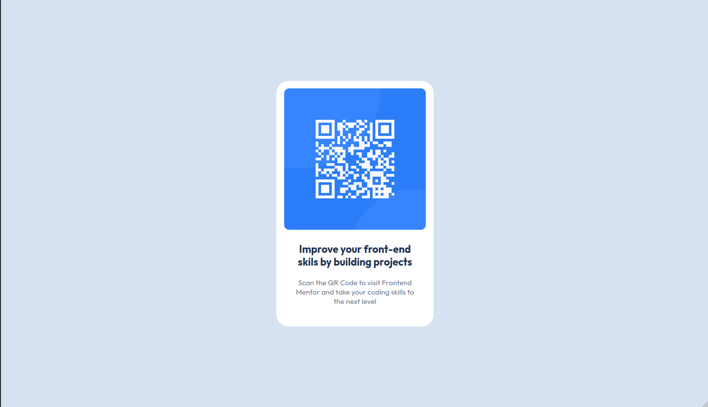

# Frontend Mentor - QR code component solution

This is a solution to the [QR code component challenge on Frontend Mentor](https://www.frontendmentor.io/challenges/qr-code-component-iux_sIO_H). Frontend Mentor challenges help you improve your coding skills by building realistic projects.

## Table of contents

- [Overview](#overview)
  - [Desktop screenshot](#desktop-screenshot)
  - [Mobile screenshot](#mobile-screenshot)
  - [Links](#links-tba)
- [My process](#my-process)
  - [Built with](#built-with)
  - [What I learned](#what-i-learned)
  - [Useful resources](#useful-resources)

## Overview

### Desktop screenshot

@1140px

### Mobile screenshot

@ 360px (Galaxy Note 3)

### Links (TBA)

- Solution URL: [Add solution URL here](https://your-solution-url.com)
- Live Site URL: [Add live site URL here](https://your-live-site-url.com)

## My process

### Built with.

- React + Vite + SCSS

### What I learned

- [Sass](https://sass-lang.com/)
- Really like the [web.dev](https://web.dev/learn/css/welcome) resources. Allways a good place to refresh and deepen your knowledge
